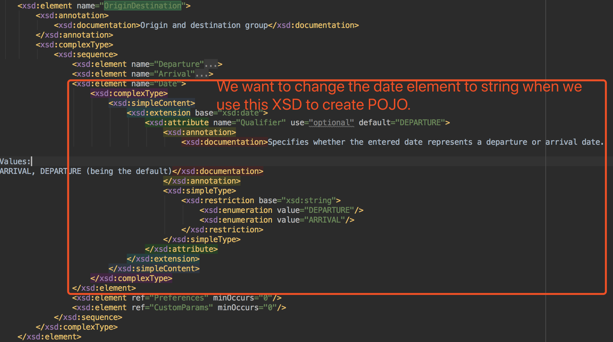

We have two way to customize the binding of JAXB. The detail can be found in this page [Customize JAXB](https://docs.oracle.com/javase/tutorial/jaxb/intro/custom.html).

- Internal Binding <br/>
    - put the binding tag in the schema file directly.

- External Binding
    - [Note that this customization is per namespace](https://javaee.github.io/jaxb-v2/doc/user-guide/ch03.html#customization-of-schema-compilation-customizing-java-packages) . 
    That is, even `if your schema is split into multiple schema documents, you cannot put them into different packages if they are all in the same namespace`.
    - XMLBeans by default converts all XSD date and date time elements to a Java Calendar object. With JAXB however, by default the XMLGregorianCalendar is used. 
    Yet again the global bindings came to the rescue and this was handled with the below configuration which converted all XSD date elements to a Java Calendar object.
        ``` xml
        <jxb:bindings 
        xmlns:xs="http://www.w3.org/2001/XMLSchema"
        xmlns:jxb="http://java.sun.com/xml/ns/jaxb"
        jxb:extensionBindingPrefixes="xjc"
        version="2.1">
            <jxb:globalBindings>
               <jxb:javaType name="java.util.Calendar" xmlType="xs:dateTime"
                        parseMethod="javax.xml.bind.DatatypeConverter.parseDateTime"
                        printMethod="javax.xml.bind.DatatypeConverter.printDateTime"/>
                    <jxb:javaType name="java.util.Calendar" xmlType="xs:date"
                        parseMethod="javax.xml.bind.DatatypeConverter.parseDate"
                        printMethod="javax.xml.bind.DatatypeConverter.printDate"/>
                    <jxb:javaType name="java.util.Calendar" xmlType="xs:time"
                        parseMethod="javax.xml.bind.DatatypeConverter.parseTime"
                        printMethod="javax.xml.bind.DatatypeConverter.printTime"/>
            </jxb:globalBindings>
        </jxb:bindings>
        ```
    - [Syntax](https://docs.oracle.com/javase/tutorial/jaxb/intro/custom.html#bnbcm).
    - 
    
- **Change the type of one element**.<br>
  For example, as the picture below shows, I want to change the date to string when I use xjc to create POJO.
  <br>
  
  <br>
  ***There are three ways I can try to reach this. Keep in mind that we need to add the complexType into the node attribute, if we use \<javaType> or \<class> to do this.
  If the matched node is not complexType, we would encounter these kind errors: <br>
  `java.lang.IllegalArgumentException: Illegal class inheritance loop.  Outer class String may not subclass from inner class: String`<br>
  `[ant:xjc] [ERROR] compiler was unable to honor this class customization. It is attached to a wrong place, or its inconsistent with other bindings.`<br>
  `[ant:xjc] [ERROR] compiler was unable to honor this javaType customization. It is attached to a wrong place, or its inconsistent with other bindings.`***
  - Use \<jxb:class>, below is the binding code. Here, we need match the complexType.
    ``` xml
    <jxb:bindings schemaLocation="../FareSearchRQ.xsd" node="/xs:schema">
        <jxb:bindings node="//xs:element[@name='OriginDestination']/xs:complexType/xs:sequence/xs:element[@name='Date']/xs:complexType">
            <jxb:class name="string" implClass="java.lang.String"></jxb:class>
        </jxb:bindings>
    </jxb:bindings>
    ```
    Unfortunately, I can only set the field as what I want, the getter and setter method still generated in a way I don't want. Actually, the generated code can not be compiled. See below. 
    ```
    public class OriginDestination {
        ...
        @XmlElement(name = "Date", required = true, type = java.lang.String.class)
        protected java.lang.String date;

        public OriginDestination.String getDate() {
            return date;
        }
       
        public void setDate(OriginDestination.String value) {
            this.date = ((java.lang.String) value);
        }
        ...
    }
    
    ```
  - Use \<jxb:javaType>. Here, we need match the complexType.
  
    ``` xml
    <jxb:bindings schemaLocation="../FareSearchRQ.xsd" node="/xs:schema">
        <jxb:bindings node="//xs:element[@name='OriginDestination']/xs:complexType/xs:sequence/xs:element[@name='Date']/xs:complexType">
            <jxb:property>
                <jxb:baseType>
                    <jxb:javaType name="java.lang.String"/>
                </jxb:baseType>
            </jxb:property>
        </jxb:bindings>
    </jxb:bindings>
    ```
    Below is the generated code.
    ```
    @XmlRootElement(name = "OriginDestination")
    public class OriginDestination {
        ...
        @XmlElement(name = "Date", required = true)
        protected OriginDestination.Date date;
        public OriginDestination.Date getDate() {
            return date;
        }

        public void setDate(OriginDestination.Date value) {
            this.date = value;
        }
        @XmlAccessorType(XmlAccessType.FIELD)
        @XmlType(name = "", propOrder = {
            "value"
        })
        public static class Date {
    
            @XmlValue
            @XmlJavaTypeAdapter(Adapter1 .class)
            @XmlSchemaType(name = "date")
            protected String value;
            @XmlAttribute(name = "Qualifier")
            protected String qualifier;

            public String getValue() {
                return value;
            }

            public void setValue(String value) {
                this.value = value;
            }
        ...    
        }
        ...
    }
    ```
    Even thought the date field is not String, but the value in the Date class is String. So finally, I get what I want, see below.
    ``` xml
    <OriginDestination>
        <Departure>
            <CityCode>YEG</CityCode>
        </Departure>
        <Arrival>
            <CityCode>YYZ</CityCode>
        </Arrival>
        <Date>2019-07-23</Date>
        <Preferences Sort="DEFAULT"/>
    </OriginDestination>
    ```
        
  - Use \<jxb:baseType>,
    ``` xml
    <jxb:bindings schemaLocation="../FareSearchRQ.xsd" node="/xs:schema">
        <jxb:bindings node="//xs:element[@name='OriginDestination']/xs:complexType/xs:sequence/xs:element[@name='Date']">
            <jxb:property>
                <jxb:baseType name="java.lang.String" />
            </jxb:property>
        </jxb:bindings>
    </jxb:bindings>
    ```
    Here, you can see, the field, getter and setter are all we want. But the annotation on the field has different type for this field. 
    ```
    @XmlRootElement(name = "OriginDestination")
    public class OriginDestination {
        ...
        @XmlElement(name = "Date", required = true, type = OriginDestination.Date.class)
        protected String date;

        public String getDate() {
            return date;
        }
    
        public void setDate(String value) {
            this.date = value;
        }
        ... 
    }
    ```
    But there is a flaw here, the \<Date> has a unused namespace.
    ``` xml
    <OriginDestination>
        <Departure>
            <CityCode>YEG</CityCode>
        </Departure>
        <Arrival>
            <CityCode>YYZ</CityCode>
        </Arrival>
        <Date xsi:type="ns4:string" xmlns:ns4="http://www.w3.org/2001/XMLSchema">2019-07-23</Date>
        <Preferences Sort="DEFAULT"/>
    </OriginDestination>
    ``` 
    <br>

    --------
    Then, I put the complexType in the node path,see below.
    ``` xml
    <jxb:bindings schemaLocation="../FareSearchRQ.xsd" node="/xs:schema">
        <jxb:bindings node="//xs:element[@name='OriginDestination']/xs:complexType/xs:sequence/xs:element[@name='Date']/xs:complexType">
            <jxb:property>
                <jxb:baseType name="java.lang.String" />
            </jxb:property>
        </jxb:bindings>
    </jxb:bindings>
    ```
    I get a Date object here. But the value in Date is not `XMLGregorianCalendar`, it is a `String`. So it looks like match what I want. `It is the same as what I use <jxb:javaType> to generated.` So let's go on.
    ```
    @XmlRootElement(name = "OriginDestination")
    public class OriginDestination {
        ...
        @XmlElement(name = "Date", required = true)
        protected OriginDestination.Date date;
        
        public OriginDestination.Date getDate() {
            return date;
        }
    
        public void setDate(OriginDestination.Date value) {
            this.date = value;
        }
        
        public static class Date {
    
            @XmlValue
            @XmlSchemaType(name = "date")
            protected String value;
            @XmlAttribute(name = "Qualifier")
            protected String qualifier;
    
            public String getValue() {
                return value;
            }
    
            public void setValue(String value) {
                this.value = value;
            }
        }
    }
    ```
    Below is the generated xml message. So I think I can accept this.
    ``` xml
    <OriginDestination>
        <Departure>
            <CityCode>YEG</CityCode>
        </Departure>
        <Arrival>
            <CityCode>YYZ</CityCode>
        </Arrival>
        <Date>2019-07-23</Date>
        <Preferences Sort="DEFAULT"/>
    </OriginDestination>
    ```
  Finally, I choose the last solution to reach my purpose.