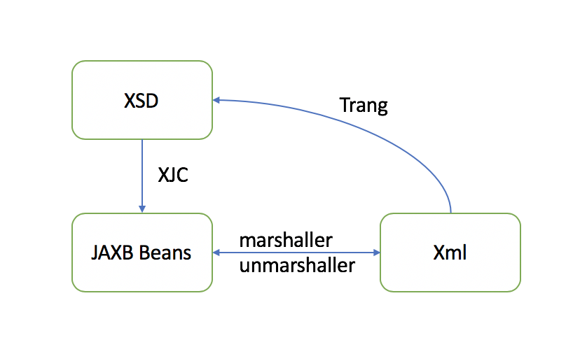

# Java Architecture for Xml Binding
Here is a simple [tutorials](https://www.w3cschool.cn/jaxb2/jaxb2-5hnk2zo8.html) for JAXB. And below is the overview of JAXB tech.
<br>



# XJC tool
XJC is a tool built in Java before Java 8. If we want to use it in higher Java version, we need download it separately.
Compiles an XML schema file into fully annotated Java classes.
We can use this to involve xjc into java object through `Gradle`. 
```
 ant.xjc(package: $PackageName, destdir: project.ext.generatedSrcDir) {
    binding(dir: $BindingDir, includes: 'a.xjb, b.xjb')
    schema(dir: $SchemaDir, includes: "*.xsd")
}
```
### Customization of XSD(Xml Schema Definition) to Java Class
The detail of JAXB binding can be found [here](https://docs.oracle.com/javase/tutorial/jaxb/intro/custom.html). Or you can read 
[this](./CustomizationBinding.md) for some examples which are written by myself.

# Intellij tool
If we have WSDL file, we can use Intellij tool to generate a client. I have tried to use Intellij to generate java class from WSDL file and XSD file according 
to this [article](https://www.jetbrains.com/help/idea/generate-java-code-from-wsdl-or-wadl-dialog.html).
### Enable web service client
[here](https://www.jetbrains.com/help/idea/enabling-web-service-client-development-support.html)


# Customized Namespace Prefixes
- Just mainly use `NamespacePrefixMapper` to do this. [namespace prefixes](https://www.intertech.com/Blog/jaxb-tutorial-customized-namespace-prefixes-example-using-namespaceprefixmapper/)
- There is an other way to customized the namespace prefix. It is use the package-info.java file. You have to put a package-info.java file to the package which the java class located. 
And put below code at the beginning of the file.
    ```
    @XmlSchema(
            xmlns={
                    @XmlNs(prefix="t", namespaceURI="xxs")
            }
    )
    ```
- If multiple elements have the same namespace but with different prefix. I didn't find a way to do this.

# Change default behavior of marshal and unmarshal.
As far as I know, there are there annotations can be use to change the default behavior of marshal and unmarshal.
- [XmlJavaTypeAdapter](./XmlJavaTypeAdapter.md)
- [XmlTransient](./XmlTransient)
- [XmlAnyElement](./XmlAnyElement)
